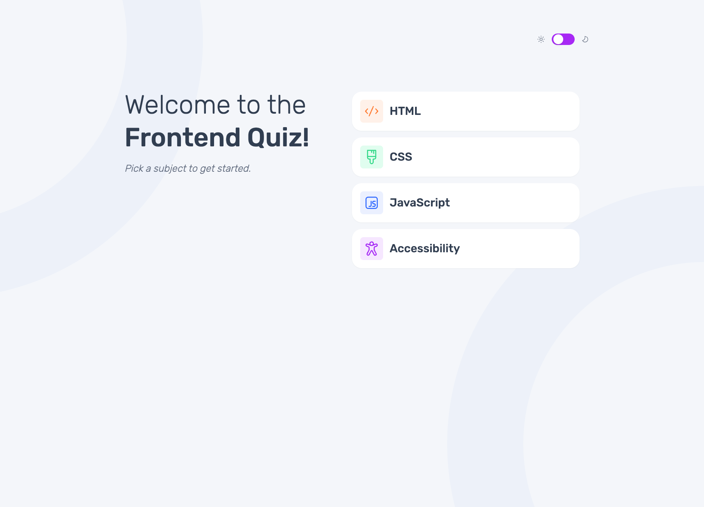
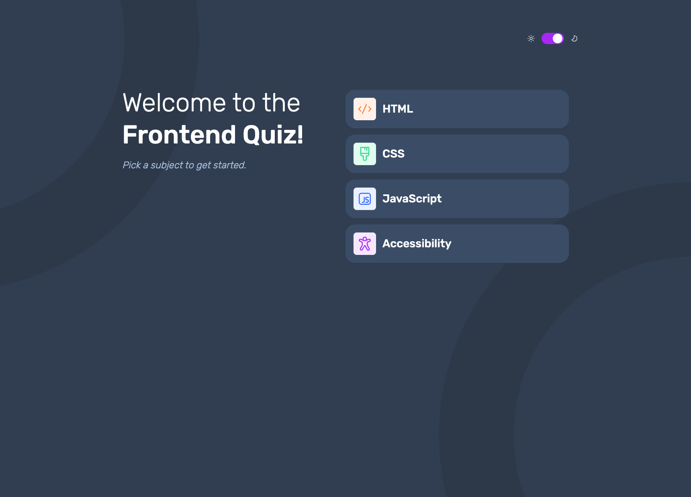
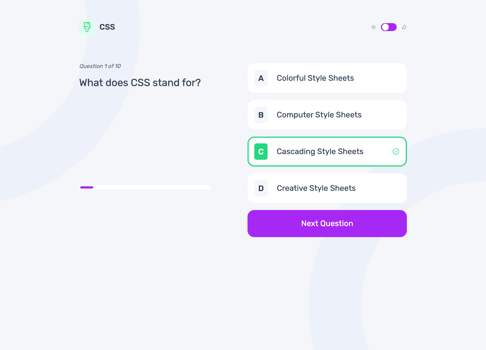
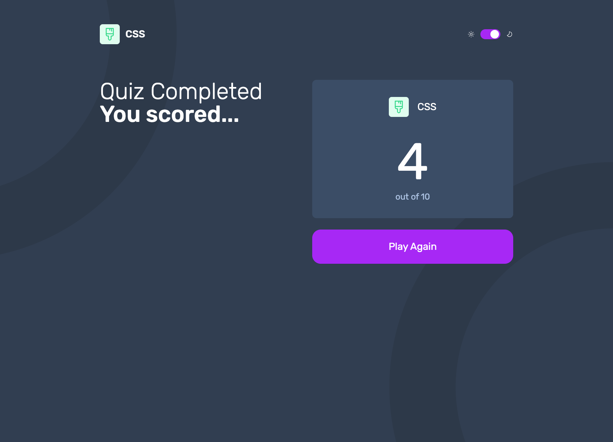

# Frontend Mentor - Frontend quiz app solution

This is a solution to the [Frontend quiz app challenge on Frontend Mentor](https://www.frontendmentor.io/challenges/frontend-quiz-app-BE7xkzXQnU). Frontend Mentor challenges help you improve your coding skills by building realistic projects.

## Table of contents

- [The challenge](#the-challenge)
- [Screenshot](#screenshot)
- [Links](#links)
- [My process](#my-process)
  - [Built with](#built-with)
  - [What I Learned](#what-i-learned)
  - [Continued development](#continued-development)
  - [Useful resources](#useful-resources)
- [Author](#author)
- [Acknowledgments](#acknowledgments)

### The challenge

Users should be able to:

- Select a quiz subject
- Select a single answer from each question from a choice of four
- See an error message when trying to submit an answer without making a selection
- See if they have made a correct or incorrect choice when they submit an answer
- Move on to the next question after seeing the question result
- See a completed state with the score after the final question
- Play again to choose another subject
- View the optimal layout for the interface depending on their device's screen size
- See hover and focus states for all interactive elements on the page
- Navigate the entire app only using their keyboard
- **Bonus**: Change the app's theme between light and dark

### Screenshot

### Links

- Solution URL: [frontendmentor.io](https://www.frontendmentor.io/solutions/quiz-app-Uz8QquhHzC)
- Live Site URL: [cancirkin.github.io](https://cancirkin.github.io/next-quiz-app)

## My process

### Built with

- Semantic HTML5 markup
- CSS custom properties
- Flexbox
- CSS Grid
- Mobile-first workflow
- Tailwind-CSS
- [React](https://reactjs.org/) - JS library
- [Next.js](https://nextjs.org/) - React framework

### What I Learned

- After completing the project, I did research on dynamic classes on tailwind. Mostly users says use [TwMerge](https://www.npmjs.com/package/tailwind-merge). I dropped a stackoverflow link below.

### Continued development

-Need to improve my dynamic tailwind css classes code.
-When you select a quiz title on landing page, i write the title in the header. At this point i used search params and reimport the data and find the quiz title. This is ok but it is not best practice.

### Useful resources

- [Next.js Docs](https://nextjs.org/docs)
- [Tailwind Docs](https://tailwindcss.com/docs)
- [Dynamic Class Problem](https://stackoverflow.com/questions/72148525/tailwindcss-3-classes-doesnt-override-previous-classes)

## Author

- Frontend Mentor - [@cancirkin](https://www.frontendmentor.io/profile/cancirkin)
- Twitter - [@hcancirkin](https://www.twitter.com/hcancirkin)
